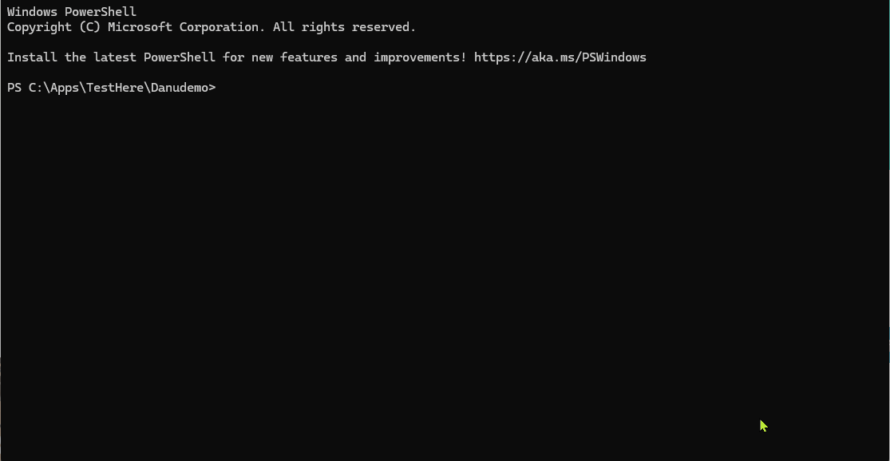

# Danucode

[](https://www.npmjs.com/package/danucode)
[](https://github.com/zabarich/danucode/actions/workflows/ci.yml)
[](LICENSE)
[](https://nodejs.org)

**Danucode is a JavaScript SDK for building coding agents. It ships with a complete CLI.**

The core is an importable library with zero terminal dependencies. The CLI is built on top of it. Same npm package, two entry points.

```bash
npm install danucode
```

## What's New in v1.1.0

**Graph memory** replaces the flat JSON memory system with a relationship graph:

- **Typed nodes** -- memories are classified as `concept`, `file`, `pattern`, `preference`, or `decision`
- **Relationship edges** -- `relates-to`, `depends-on`, `caused-by`, `prefers`, `references` between nodes
- **BFS traversal** -- `/memory related <id>` walks the graph to find connected memories
- **Relevance scoring** -- system prompt injection ranks memories by project match, recency, type, connectivity, and access frequency with diversity enforcement (max 5 per type, content deduplication)
- **Keyword extraction** -- bidirectional prefix matching ("env" finds "environment" and vice versa), duplicate detection ignoring generic tokens
- **Pinning** -- `/memory pin <id>` protects important nodes from pruning and scoring decay. Preference and decision nodes auto-pin.
- **Degree caps** -- nodes max out at 12 edges (16 if pinned) to prevent hub explosion
- **LLM tools** -- `MemoryStore` and `MemoryQuery` let the agent create and search memories during conversation
- **Auto-migration** -- existing `memories.json` converts to `graph.json` on first load (zero edges, no data loss)

New commands: `/memory link`, `/memory related`, `/memory graph`, `/memory pin`

### v1.0.0

- **Importable Agent class** -- `import { Agent } from 'danucode'` gives you the full agent engine as a library
- **Structured event system** -- every LLM response, tool call, and state change is an `EventEmitter` event with risk classification
- **Zero terminal dependencies in core** -- no chalk, no ink, no readline. Runs headless in any JavaScript environment
- **`--json` output mode** -- pipe `danu` output as NDJSON for automation and integration
- **Permission policy engine** -- plug in your own approval logic instead of interactive prompts
- **Clean separation** -- `core/` (SDK) and `cli/` (terminal UI) with a one-way dependency

## SDK Usage

```javascript
import { Agent, EventType } from 'danucode';

const agent = Agent.create();

agent.on(EventType.TEXT, (e) => process.stdout.write(e.content));
agent.on(EventType.TOOL_START, (e) => console.log(`  [${e.risk}] ${e.tool}: ${e.detail}`));
agent.on(EventType.TOOL_DONE, (e) => console.log(e.success ? '  OK' : '  FAILED'));

await agent.run('fix the failing tests');
```

The Agent class extends `EventEmitter`. Subscribe to structured events to build any UI you want -- a web frontend, a Slack bot, a CI reporter, a VS Code extension.

### Agent API

```javascript
const agent = Agent.create();

await agent.run(message, { signal });     // one-shot prompt
await agent.send(message, { signal });    // continue conversation

agent.getMessages();                       // conversation history
agent.getTokenEstimate();                  // rough token count
agent.stop();                              // cancel current operation

agent.save('my-session');                  // persist to disk
agent.load('my-session');                  // restore
agent.clear();                             // reset conversation
await agent.compact();                     // compress context
```

### Events

| Event | Payload | When |
|---|---|---|
| `text` | `{ content }` | LLM streams a line of text |
| `text-done` | `{}` | LLM finished its response |
| `tool-start` | `{ tool, detail, risk, category }` | Tool call begins |
| `tool-output` | `{ content, truncated }` | Tool produced output |
| `tool-done` | `{ success, summary }` | Tool call completed |
| `task-update` | `{ tasks, completed, total }` | Task list changed |
| `interrupted` | `{ reason }` | Operation cancelled |
| `error` | `{ message }` | Something went wrong |

### Risk Classification

Every tool call is tagged with a risk level and category:

```javascript
import { classifyRisk, getCategory } from 'danucode';

classifyRisk('Bash', { command: 'ls' });        // 'caution'
classifyRisk('Bash', { command: 'rm -rf /' });   // 'danger'
classifyRisk('Read', { file_path: 'x.js' });     // 'safe'
getCategory('Bash');                              // 'shell'
getCategory('Grep');                              // 'search'
```

Risk levels: `safe`, `caution`, `danger`. Categories: `read`, `search`, `edit`, `shell`, `task`.

### Custom Permissions

The SDK's permission system is a policy engine, not a prompt. Plug in your own logic:

```javascript
import { setPermissionHandler } from 'danucode';

setPermissionHandler(async (toolName, args) => {
  if (toolName === 'Read') return 'y';
  if (toolName === 'Bash') return 'n';
  return await askMyCustomUI(toolName, args);
});
```

### What You Can Build

- Custom CLIs with different UIs or workflows
- Web backends that expose agent capabilities via HTTP
- CI/CD bots that fix failing tests automatically
- VS Code extensions with embedded agent support
- Slack/Discord bots that respond to coding requests
- Testing harnesses that run agents programmatically
- Monitoring dashboards that consume the event stream

## CLI Usage

```bash
npm install -g danucode
```

Create `~/.danu/config.json`:

```json
{
  "base_url": "http://localhost:11434/v1",
  "api_key": "ollama",
  "model": "qwen2.5-coder:32b"
}
```

```bash
danu                    # interactive TUI
danu --yolo             # skip permission prompts
danu -c "fix the bug"  # one-shot mode
danu --json -c "..."   # NDJSON output (pipeable)
danu doctor             # check your setup
```



### NDJSON Output Mode

`--json` suppresses all terminal formatting and outputs every agent event as one JSON object per line:

```bash
$ danu --json --yolo -c "what is 2+2"
{"type":"text","content":"4"}
{"type":"text-done"}
```

Pipe it to `jq`, feed it to a web socket, log it to a file:

```bash
danu --json --yolo -c "fix the bug" | jq 'select(.type == "tool-start")'
danu --json --yolo -c "refactor auth" > events.jsonl
```

Each line is a valid JSON object with a `type` field matching the SDK event names: `text`, `text-done`, `tool-start`, `tool-output`, `tool-done`, `error`, `interrupted`, `task-update`.

## Architecture

```
danucode/
  core/                  SDK (zero terminal dependencies)
    index.js             Public API: Agent, EventType, tools, permissions
    agent.js             Agent class (EventEmitter)
    loop.js              Conversation loop (emits events, no console.log)
    events.js            Event types, risk classification
    permissions.js       Permission policy engine (not prompts)
    api.js               LLM clients (OpenAI-compatible + Anthropic native)
    context.js           Token estimation, compaction
    memory.js            Graph memory (nodes, edges, BFS, relevance scoring)
    tools/               17 built-in tools (including MemoryStore, MemoryQuery)
    ...

  cli/                   Terminal UI (imports from core/, never the reverse)
    commands.js          Slash commands (/help, /mode, /plan, etc.)
    permissions-prompt.js Interactive permission prompts
    markdown.js          Terminal markdown rendering
    ui/                  Ink/React components
    ...

  bin/danu.js            CLI entry point
```

The dependency arrow goes one way: **cli/ -> core/**. Nothing in `core/` imports from `cli/`. Nothing in `core/` uses `console.log`, `chalk`, `ink`, `react`, or `readline`.

## Danucode vs Aider vs Claude Code

| | Danucode | Aider | Claude Code |
|---|---|---|---|
| **What it is** | JavaScript SDK + CLI. Import the agent as a library. | Python CLI pair programmer with deep git integration. | Full agentic platform from the model provider. |
| **Embeddable** | Yes -- `import { Agent } from 'danucode'` | No (CLI only) | No (CLI + IDE plugins) |
| **Event stream** | EventEmitter with risk classification, `--json` NDJSON output | No | No |
| **Custom permissions** | Pluggable policy function | No | No |
| **Language** | JavaScript (~4k LOC, readable in an afternoon) | Python (large codebase) | Node.js (closed source) |
| **License** | MIT | Apache 2.0 | Proprietary |
| **Backend** | Any OpenAI-compatible + native Anthropic | Any OpenAI-compatible + native Claude, Gemini, DeepSeek | Claude only |
| **Local / air-gapped** | First-class. Zero cloud dependency. | With local models | Requires Anthropic API |
| **Account required** | No | No | Yes |
| **Git integration** | Manual | Automatic commits | Automatic commits, PRs |
| **Modes** | code, architect, ask, debug | code, architect, ask | Interactive, headless |
| **MCP support** | Configurable | No | Extensive |
| **Sub-agents** | Agent tool + SendMessage | No | Agent Teams |
| **Maturity** | v1.1.0 | Production (years) | Production (Anthropic-backed) |

If you want the most capable tool, use Claude Code. If you want proven open-source with broad model support, use Aider. If you want an embeddable agent SDK for JavaScript that you can fully understand, modify, and point at your own infrastructure -- that is what Danucode is for.

## Features

**17 Tools:** Bash, Read, Write, Edit, Grep, Glob, Patch, Agent, SendMessage, WebSearch, WebFetch, GitHub, LSP, NotebookEdit, Tasks, MemoryStore, MemoryQuery

**4 Modes:** `code` (full access) -- `architect` (read-only + markdown) -- `ask` (read-only) -- `debug` (diagnostic focus)

**Plan mode:** `/plan` to explore and design before implementing

**Project context:** `DANUCODE.md` loaded into the system prompt -- `/init` generates one

**Graph memory:** Relationship graph at `~/.danu/memory/graph.json` with typed nodes and edges. `/memory save` creates nodes, `/memory link` connects them, `/memory related` traverses connections, `/memory graph` shows the full structure, `/memory pin` protects important nodes. Relevant memories are scored and injected into the system prompt automatically. The LLM can also create and query memories via `MemoryStore` and `MemoryQuery` tools.

**Sessions:** `--session name` auto-saves and resumes

**Permissions:** `y/n/a(lways)` per tool -- `--yolo` to bypass -- or plug in your own policy

**Extensibility:** MCP servers -- custom tools in `.danu/tools/` -- hooks -- configurable search

## Configuration

Config loads from (later overrides earlier):
1. `~/.danu/config.json` (user)
2. `./danu.config.json` (project)
3. `--config <path>` (CLI)

See `danu.config.example.json` for all options.

### Backend Examples

**Ollama:** `{ "base_url": "http://localhost:11434/v1", "api_key": "ollama", "model": "qwen2.5-coder:32b" }`

**llama.cpp:** `{ "base_url": "http://localhost:8080/v1", "api_key": "none", "model": "my-model.gguf" }`

**vLLM:** `{ "base_url": "http://localhost:8000/v1", "api_key": "token", "model": "Qwen/Qwen2.5-32B" }`

**OpenAI:** `{ "base_url": "https://api.openai.com/v1", "api_key": "sk-...", "model": "gpt-4o" }`

**Anthropic (native):** `{ "base_url": "https://api.anthropic.com", "provider": "anthropic", "api_key": "sk-ant-...", "model": "claude-haiku-4-5-20251001" }`

## Testing

```bash
npm test
```

70 tests covering tool execution, permission boundaries, token estimation, context management, and graph memory (CRUD, deduplication, BFS traversal, keyword extraction, relevance scoring, pruning, migration). Node.js built-in test runner, no external framework.

## Security

Danucode can execute shell commands and modify files. Read [SECURITY.md](SECURITY.md).

Key points: permission prompts by default, `.danuignore` for sensitive files, pluggable permission policies, mode-based restrictions, no telemetry, data only goes to your configured endpoint.

## Roadmap

Next priorities:
- Model compatibility matrix (which models work well with tool calling)
- Skills system (markdown prompt templates)

See [CHANGELOG.md](CHANGELOG.md) for what's already built.

## Contributing

See [CONTRIBUTING.md](CONTRIBUTING.md).

## License

MIT. (c) Danucore.
